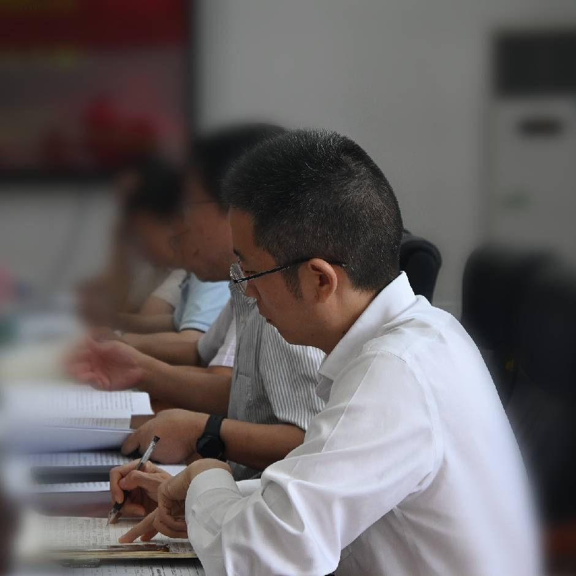

# 🌟 探地雷达图像处理培训课程

  

## 📋 项目简介

本项目是**中南大学智能雷达实验室**为即将进组的同学准备的培训项目，涵盖从Python基础到深度学习在探地雷达领域的应用。项目设计与文档由智能雷达实验室成员精心编写，旨在帮助新成员快速融入实验室研究工作。

## 🚀 培训内容

### 📚 第一部分：Python基础与gprMax数据生成
1. **Python常用函数库介绍** 🐍
   - **OS库**：文件和目录操作
   - **Random库**：随机数生成
   - **Glob库**：文件路径模式匹配
   - **Numpy库**：科学计算基础
   - **Matplotlib库**：数据可视化
   - **Pandas库**：数据处理与分析

2. **gprMax库基础** 📊
   - **gprMax简介与安装**
   - **gprMax配置GPU加速**
   - **基本in文件参数编写设置**
   - **命令行操作**

3. **实战案例：批量生成gprMax仿真数据** 🔄
   - **数据批量生成流程**
   - **批处理脚本编写**
   - **数据存储与组织**
   - **常见问题与解决方案**

### 🔍 第二部分：gprMax高级应用与数据处理
1. **gprMax数据格式与解析** 📁
   - **HDF5格式介绍**
   - **h5py库的使用**
   - **数据读取与预处理**

2. **gprMax高级功能** ⚙️
   - **自定义目标导入**
   - **材质参数定义与导入**
   - **复杂场景建模技巧**

3. **电磁波传播路径可视化** 📈
   - **Snapshot功能详解**
   - **ParaView工具介绍**
   - **数据导入与可视化操作**

### 🧠 第三部分：PyTorch与深度学习基础
1. **深度学习理论基础** 📖
   - **神经网络基本原理**
   - **激活函数与非线性**
   - **前向传播与反向传播**
   - **梯度下降算法**
   - **过拟合与正则化**
   - **批量归一化**
   - **卷积神经网络原理**
   - **池化操作与降维**

2. **PyTorch基础** 🔥
   - **张量操作**
   - **自动微分**
   - **模型构建基础**
   - **GPU加速**

3. **深度学习流程实战：手写数字识别** ✍️
   - **数据集准备与加载**
   - **模型设计与实现**
   - **损失函数与优化器**
   - **训练与验证**
   - **模型评估与测试**

4. **GPR数据深度学习实战：钢筋杂波去除** 🔧
   - **GPR数据集构建**
   - **数据预处理与增强**
   - **UNet模型架构详解**
   - **模型训练与调优**
   - **结果分析与评估**

### 💻 第四部分：Linux基础与云环境部署
1. **Linux操作系统基础** 🐧
   - **文件系统与目录结构**
   - **用户权限管理**
   - **常用命令详解**
   - **ssh连接基础**

2. **矩池云平台** ☁️
   - **环境配置**
   - **文件上传与下载**
   - **任务运行与监控**

3. **实战部署** 🚀
   - **gprMax批量仿真脚本部署**
   - **深度学习模型训练部署**
   - **常见问题排查**

### 🔮 第五部分：前沿技术与应用分享
1. **探地雷达领域深度学习模型概览** 📡
   - **CNN家族模型**
   - **注意力机制与Transformer**
   - **无监督学习**
   - **扩散模型**

2. **实验室研究成果分享** 📝
   - **已发表论文方法解析**
   - **代码实现与训练流程**
   - **实验结果分析**
   - **研究难点与解决思路**

3. **研究方向与未来展望** 🌈

## 💼 参考资料

- [gprMax官方文档](https://github.com/gprMax/gprMax)
- [PyTorch官方教程](https://pytorch.org/tutorials/)

## 👨‍💻 贡献者

<table>
  <tr>
    <td align="center"><a href="https://faculty.csu.edu.cn/leiwentai/zh_CN/index.htm"> <b>指导教师: 雷文太教授</b></a></td>
    <td align="center"><a href="https://github.com/hnkjdaxzzq"> <b>22级硕士研究生：郑智钦</b></a></td>
    <td align="center"><a href="https://github.com/xiye-csu"> <b>24级硕士研究生：王以明</b></a></td>

[//]: # (    <td align="center"><a href="https://github.com/username3"> <b>研究生B</b></a></td>)
  </tr>
</table>

## 📬 联系我们

- **邮箱**：zhengzhiqin@csu.edu.cn
- **地址**：湖南省长沙市中南大学智能雷达实验室

[//]: # (## 📄 许可证)

[//]: # ()
[//]: # (本项目采用 [MIT]&#40;LICENSE&#41; 许可证)

---

  <b>中南大学智能雷达实验室</b> 
  <i>共同探索，追求卓越</i>

